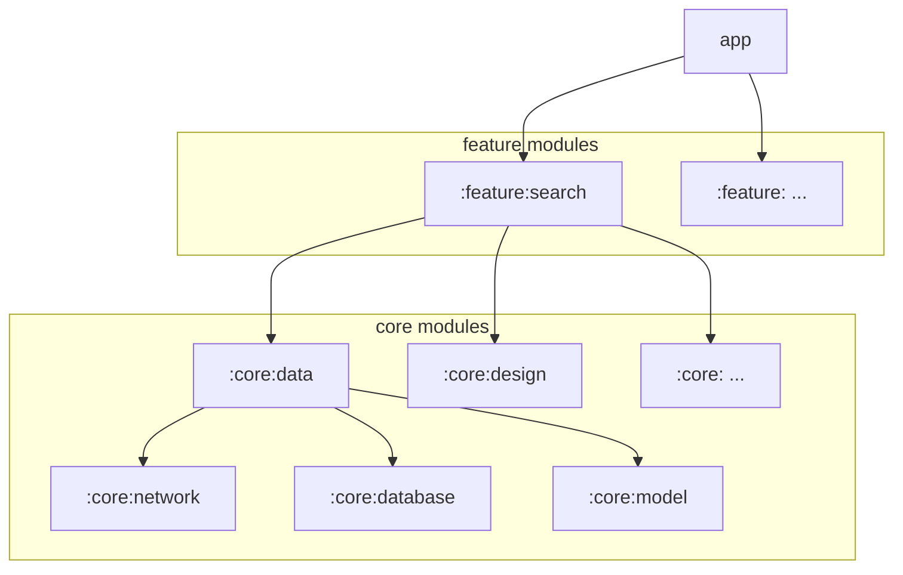

Now in MTG
===========

**Now in MTG is an offline-first Android app built with Kotlin and Jetpack Compose.**

## Arthitecture
The **Now in MTG** app is structured in the recommended Modern APP Architecture, following [Google's official architecture guidance](https://developer.android.com/topic/architecture).

## Modularization
The **Now in MTG** app adapts the modularization strategies to better organize the project, allowing it to scale as new features are added. For more information, Check out the [Google's android app modularization guidance](https://developer.android.com/topic/modularization).

To maintain dependencies in a scalable way, this app utilizes Gradle version catalogs ([Google's version catalogs migration guidance](https://developer.android.com/build/migrate-to-catalogs)) to manage the versions of dependencies and plugins, and organizes the multi-modules builds into reusable Gradle conventions plugins ([Share build logic between subprojects - Gradle](https://docs.gradle.org/current/samples/sample_convention_plugins.html)).

### Module dependency graph

<table>
  <tr>
   <td><strong>Name</strong>
   </td>
   <td><strong>Responsibilities</strong>
   </td>
  </tr>
  <tr>
   <td><code>app</code>
   </td>
   <td>Provides a entry point container that integrates the modules required for Now in MTG in the application level.
   </td>
  </tr>
  <tr>
   <td><code>:feature:...</code>
   </td>
   <td>Represents a modularized part of the app's functionality that corresponds to a screen associated with the UI components and the ViewModels. For example:
     
     :feature:randomcards - displays card gallery for random cards.
     :feature:sets - shows a list of MTG sets grouped by their released date
   </td>
  </tr>
  <tr>
   <td><code>:core:domain</code>
   </td>
   <td>Contains usecases and encapsulates logic that is reused by multiple feature modules.
   </td>
  </tr>
  <tr>
   <td><code>:core:data</code>
   </td>
   <td>Contains repositories that encapsulate the process of data fetching from both local and remote data sources.
   </td>
  </tr>
  <tr>
   <td><code>:core:database</code>
   </td>
   <td>Local data source using Room database for storage.
   </td>
  </tr>
  <tr>
   <td><code>:core:database</code>
   </td>
   <td>Remote data source using Ktor Client for making network requests and handling responses.
   </td>
  </tr>
  <tr>
   <td><code>:core:model</code>
   </td>
   <td>Model classes used throughout the app.
   </td>
  </tr>
  <tr>
   <td><code>:core:design</code>
   </td>
   <td>Base UI composables and resources used throughout the app.
   </td>
  </tr>
  <tr>
   <td><code>:core:ui</code>
   </td>
   <td>Specific UI composables used by feature modules. It is dependent on the :core:module to render the UI based on the target data type.
   </td>
  </tr>
</table>

## Tech stacks & Libraries
- Kotlin
- Coroutines Flow
- Jetpack Libraries:
  - [Jetpack Compose](https://developer.android.com/develop/ui/compose): Android’s recommended modern toolkit for building native UI
  - [Navigation Compose](https://developer.android.com/develop/ui/compose/navigation): Navigate between composables while taking advantage of the Navigation component's infrastructure and features
  - Lifecycle Compose
  - [Hilt](https://developer.android.com/training/dependency-injection/hilt-android): a dependency injection library that reduces the boilerplate of doing manual DI
  - Room Database
- [Ktor Client](https://github.com/ktorio/ktor): An asynchronous Http Client built from the ground up using Kotlin and Coroutines by JetBrains
- [Kotlin Serialization](https://kotlinlang.org/docs/serialization.html)
- [Coil](https://coil-kt.github.io/coil/): An image loading library for Android backed by Kotlin Coroutines
- [Spotless](https://github.com/diffplug/spotless)

## Open APIs
- [Magic: The Gathering API](https://docs.magicthegathering.io/) for constructing restful APIs for Random Cards and Card Details features
- [Scryfall](https://scryfall.com/docs/api) for constructing restful APIs for Sets-related features

## Thanks
Inspired by [Now in Android](https://github.com/android/nowinandroid)
